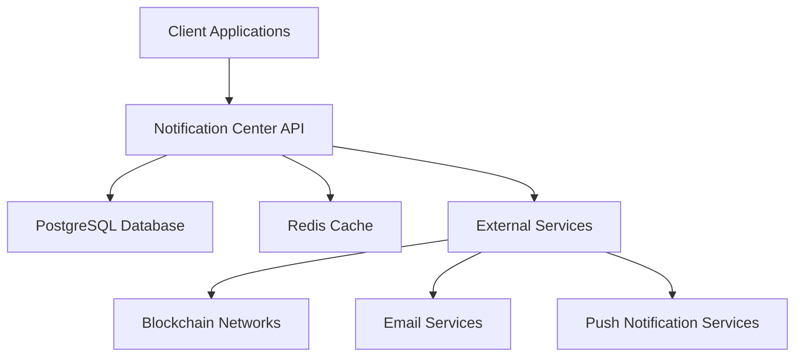

# Notification Center

## 1. Project Overview

### Purpose
The Notification Center is a microservice designed to manage notifications for Giveth.io and other DApps. It provides a centralized system for handling various types of notifications across different platforms.

### Key Features
- Centralized notification management
- Support for multiple DApps
- RESTful API interface
- Real-time notification delivery
- Customizable notification settings
- Integration with various blockchain platforms

### Live Links
- Production: [https://notification-center.giveth.io](https://notification-center.giveth.io)
- Staging: [https://notification-center-staging.giveth.io](https://notification-center-staging.giveth.io)

## 2. Architecture Overview

### System Diagram


### Tech Stack
- **Runtime**: Node.js v16
- **Language**: TypeScript v4.5.2
- **Database**: PostgreSQL v14.2
- **ORM**: TypeORM v0.3.6
- **Caching**: Redis v5.0.9
- **API Framework**: Express v4.17.3
- **Containerization**: Docker Compose v3.3
- **Documentation**: Swagger/OpenAPI
- **Testing**: Mocha v9.2.2
- **CI/CD**: GitHub Actions

### Data Flow
1. Client applications send notification requests to the API
2. Requests are validated and processed through middleware
3. Notifications are stored in PostgreSQL
4. Real-time notifications are cached in Redis
5. Notifications are delivered to appropriate channels (email, push, etc.)

## 3. Getting Started

### Prerequisites
- Node.js v16 (use `nvm use` to load appropriate version)
- Docker and Docker Compose
- PostgreSQL v14.2
- Redis v5.0.9

### Installation Steps
1. Clone the repository:
   ```bash
   git clone git@github.com:Giveth/notification-center.git
   cd notification-center
   ```

2. Install dependencies:
   ```bash
   npm ci
   ```

3. Set up the development environment:
   ```bash
   docker-compose -f docker-compose-local-postgres-redis.yml up -d
   ```

4. Configure environment variables:
   - Copy `config/example.env` to `config/development.env`
   - Update the values in `development.env` as needed

5. Run database migrations:
   ```bash
   npm run db:migrate:run:local
   ```

6. Start the development server:
   ```bash
   npm start
   ```

7. Access the API documentation at [http://localhost:3040/docs](http://localhost:3040/docs)

## 4. Usage Instructions

### Running the Application
- Development: `npm start`
- Staging: `npm run start:server:staging`
- Production: `npm run start:server:production`

### Testing
```bash
# Run all tests
npm run test

# Run specific test files
npm run test:notificationRepository
npm run test:notificationSettingRepository
```

### Database Management
- Create new migration:
  ```bash
  typeorm migration:create ./migrations/createNotificationTable
  ```
- Run migrations:
  ```bash
  npm run db:migrate:run:local
  ```
- Revert last migration:
  ```bash
  npm run db:migrate:revert:local
  ```

## 5. Deployment Process

### Environments
- **Development**: Local development environment
- **Staging**: Pre-production testing environment
- **Production**: Live production environment

### Deployment Steps
1. Build the application:
   ```bash
   npm run build
   ```

2. Run database migrations:
   ```bash
   npm run db:migrate:run:production
   ```

3. Start the server:
   ```bash
   npm run start:server:production
   ```

### CI/CD Integration
The project uses GitHub Actions for continuous integration and deployment. The workflow is defined in `.github/workflows/CI-CD.yml`.

## 6. Troubleshooting

### Common Issues
1. **Database Connection Issues**
   - Verify PostgreSQL is running
   - Check environment variables
   - Ensure migrations are up to date

2. **Redis Connection Issues**
   - Verify Redis is running
   - Check Redis configuration
   - Ensure proper network connectivity

### Logs and Debugging
- Install bunyan for better log visualization:
  ```bash
  npm i -g bunyan
  ```
- View logs:
  ```bash
  tail -f logs/notification-center.log | bunyan
  ```

## References
- [Linting TypeScript using ESLint and Prettier](https://blog.logrocket.com/linting-typescript-using-eslint-and-prettier)
- [REST API with Express TypeScript](https://rsbh.dev/blog/rest-api-with-express-typescript)
